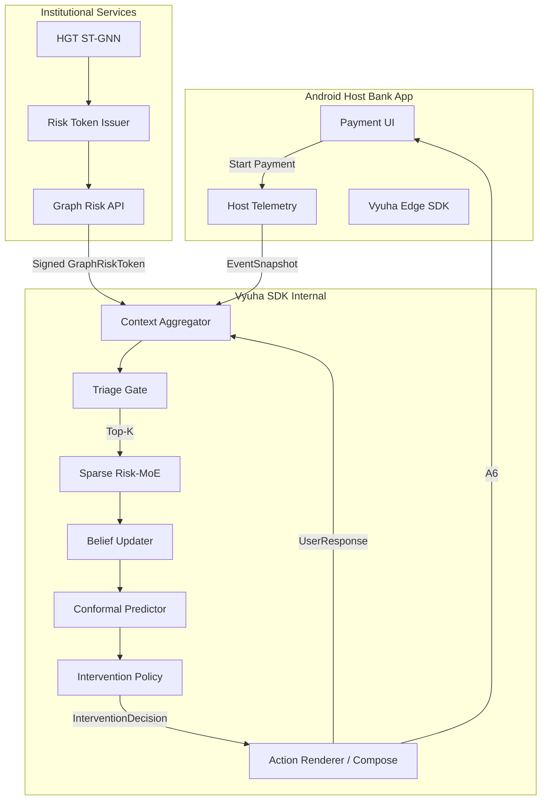
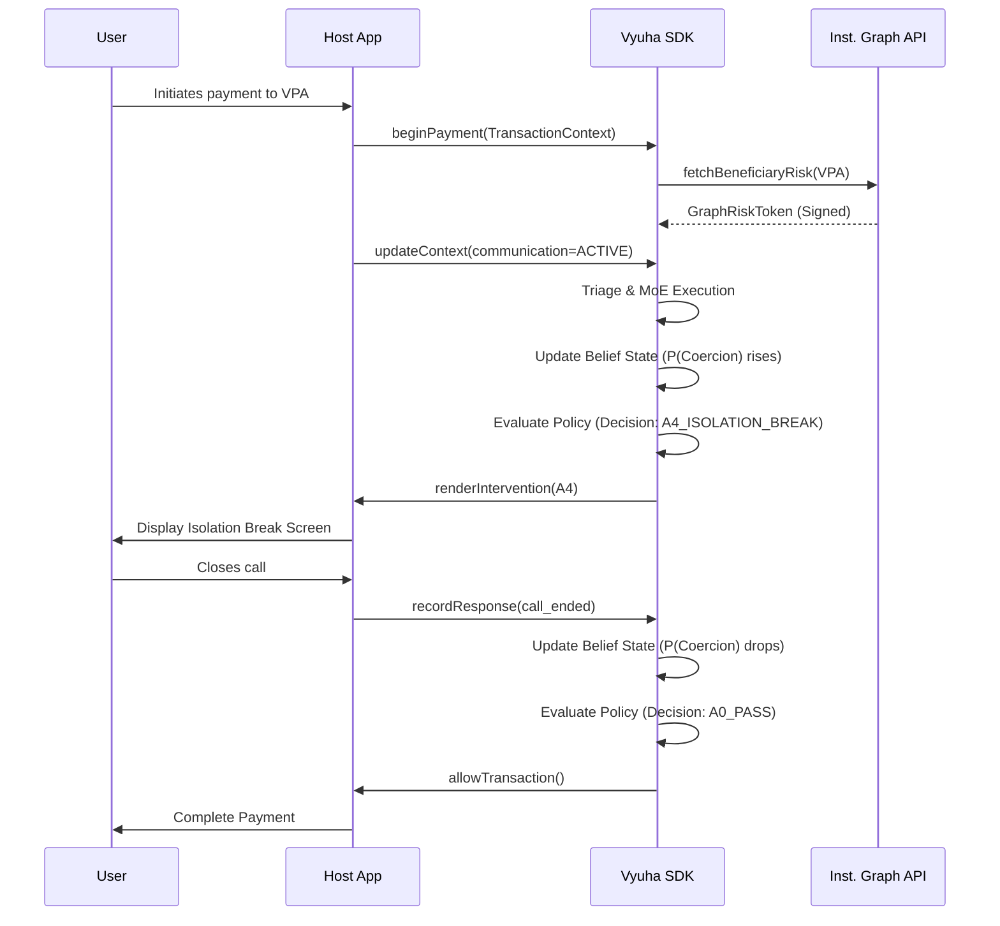
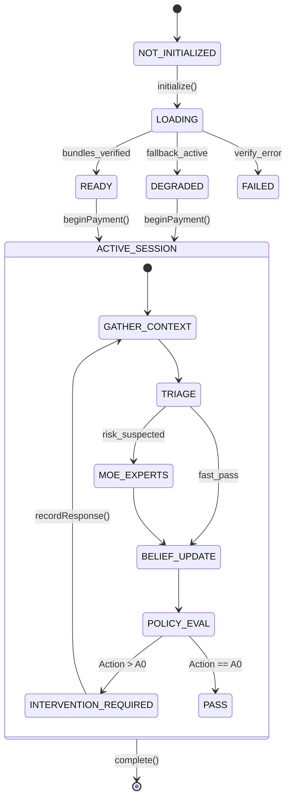
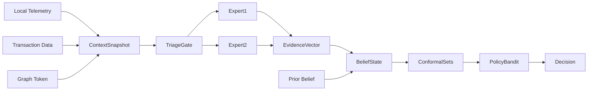
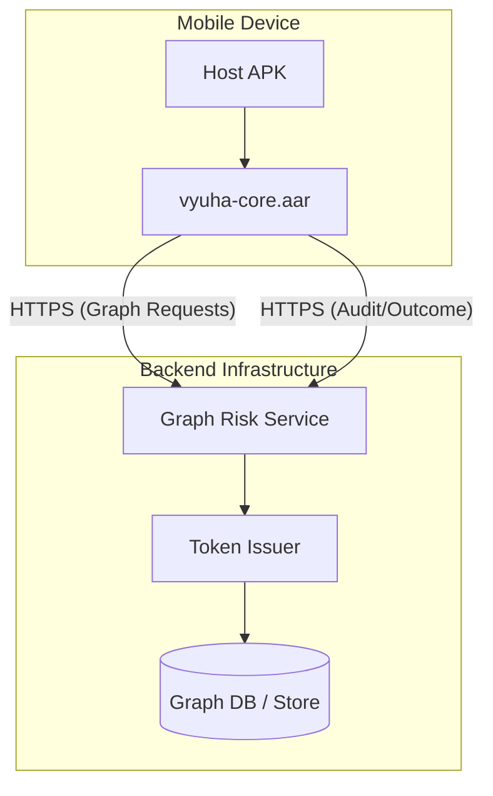
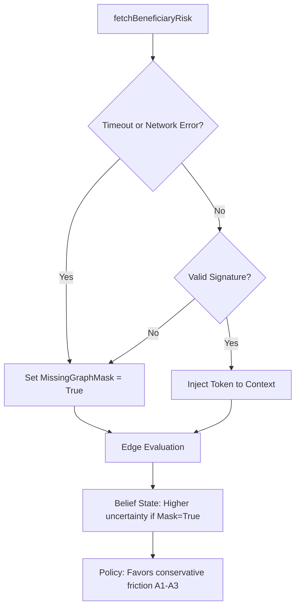
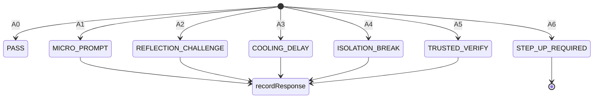

> [!IMPORTANT]
> **AI AGENT DIRECTIVE**
> This document contains strict architectural rules for VYUHA 2.0. Any AI agent or coding assistant operating in this repository must abide by these constraints. Do not deviate, simplify, or hallucinate outside these boundaries. Log any new learnings, corrections, or workflow resolutions to the `.ai/` directory.

# VYUHA 2.0: ARCHITECTURE FREEZE V1

Historical baseline. The user-authorized [ADR-005](decisions/ADR-005-dual-integrity-and-evidence.md) supersedes conflicting agency/receiver fusion, uncertainty, runtime, signing and benchmark descriptions. See the [current project guide](VYUHA_PROJECT_GUIDE.md).

## 1. APPROVED DECISIONS

### D1: Demo Platform
- **Decision**: Host-bank simulator + embedded SDK.
- **Reason**: Demonstrates the correct production relationship (embedded SDK) without pretending to have hacked a real app like PhonePe.
- **Alternatives rejected**: Fake banking application containing Vyuha, Separate Vyuha demo application watching another app.
- **Technical consequences**: Requires building a mock host app (VyuhaBank) that integrates the `vyuha-core.aar` SDK.
- **Modules affected**: `apps/android-demo`, `packages/android-sdk`
- **Owner**: Aditya
- **Tests required**: Host integration test, payment interception point tests.
- **Reversible?**: Hard to reverse late in the hackathon.
- **Production vs Hackathon**: In production, the host is a real bank app; here, it's a simulated one.

### D2: Tech Stack (Mobile)
- **Decision**: Native Android / Kotlin.
- **Reason**: SDK packaging and low latency are critical to the B2B story. `vyuha-core.aar` must exist.
- **Alternatives rejected**: Flutter.
- **Technical consequences**: Uses Kotlin, Jetpack Compose, Coroutines, Gradle, Android SDK.
- **Modules affected**: `apps/android-demo`, `packages/android-sdk`, `packages/edge-runtime`
- **Owner**: Aditya (SDK), Sneha (UI)
- **Tests required**: Android UI tests, SDK instrumentation tests.
- **Reversible?**: No.
- **Production vs Hackathon**: Same as production.

### D3: Model Runtime
- **Decision**: Hybrid (Local behavior + Institutional graph on server).
- **Reason**: Graph data is massive and belongs to institutions; behavioral data belongs on the device for privacy and offline safety.
- **Alternatives rejected**: All on-device, All in cloud.
- **Technical consequences**: Requires an edge runtime (e.g. ExecuTorch) and a Python backend service for the ST-GNN.
- **Modules affected**: `ml/edge`, `ml/graph`, `services/graph-risk-api`
- **Owner**: Trombokendu, Aditya
- **Tests required**: Local inference latency tests, Graph API latency tests.
- **Reversible?**: No.
- **Production vs Hackathon**: Same as production (backend simulated on local server for demo).

### D4: Offline Mode Definition
- **Decision**: Core safety continues functioning with `graphRisk = UNKNOWN`.
- **Reason**: Fail-safe principle. Missing institutional evidence should increase uncertainty, not block the local behavioral models.
- **Alternatives rejected**: Fully offline only (no network ever).
- **Technical consequences**: Belief state must explicitly handle missing evidence masks.
- **Modules affected**: `ml/edge/belief`, `packages/edge-runtime`
- **Owner**: Trombokendu, Aditya
- **Tests required**: Offline scenario tests (simulate network failure).
- **Reversible?**: Yes, policy logic can be changed easily.
- **Production vs Hackathon**: Same logic.

### D5: ST-GNN Architecture
- **Decision**: Heterogeneous Graph Transformer (HGT) + Temporal event encoding.
- **Reason**: Provides the best fit for genuinely heterogeneous financial graphs with temporal dynamics.
- **Alternatives rejected**: Heterogeneous GraphSAGE + GRU, TGN/TGAT (standalone).
- **Technical consequences**: Requires PyTorch Geometric, complex heterogeneous batching.
- **Modules affected**: `ml/graph/inference`, `ml/graph/training`
- **Owner**: Trombokendu
- **Tests required**: Heterogeneous link prediction, PR-AUC metrics.
- **Reversible?**: Yes, model architecture can be swapped if interfaces hold.
- **Production vs Hackathon**: In hackathon, models are trained on synthetic graphs.

### D6: Node Schema (MVP)
- **Decision**: ACCOUNT, VPA, DEVICE, PHONE.
- **Reason**: Focuses the MVP on the most critical entities for demonstrating mule rings and coercion.
- **Alternatives rejected**: Full 7-node schema (adds MERCHANT, IP, COMPLAINT).
- **Technical consequences**: Reduces data generation and model complexity.
- **Modules affected**: `ml/graph/schema`, `datasets/synthetic`
- **Owner**: Trombokendu
- **Tests required**: Graph generation schema validation.
- **Reversible?**: Yes, nodes can be added later.
- **Production vs Hackathon**: Production would use full schema.

### D7: Edge Model Complexity
- **Decision**: Sparse Risk MoE (Top-K 2 of 5 experts).
- **Reason**: Efficient runtime. Triage gate only executes necessary experts.
- **Alternatives rejected**: Dense network.
- **Technical consequences**: Requires lightweight gating network and modular expert execution.
- **Modules affected**: `ml/edge/triage`, `ml/edge/experts`
- **Owner**: Trombokendu
- **Tests required**: Expert routing validation, latency tests.
- **Reversible?**: Yes.
- **Production vs Hackathon**: If sparse execution fails during hackathon, compute all 5 and logically route, explicitly marking as a prototype fallback.

### D8: Coercion Model
- **Decision**: Belief state: `P(Coercion | observations so far)`.
- **Reason**: Coercion is sequential. No single trigger is conclusive.
- **Alternatives rejected**: Binary classifier.
- **Technical consequences**: Requires stateful recurrent log-odds update.
- **Modules affected**: `ml/edge/belief`
- **Owner**: Trombokendu
- **Tests required**: Sequential anomaly trace testing.
- **Reversible?**: No, core to the product thesis.
- **Production vs Hackathon**: Same.

### D9: Intervention Policy & Action Space
- **Decision**: Frozen offline-trained policy with A0-A6 Action Space.
- **Reason**: Online RL on live users is unsafe. Frozen policy ensures deterministic, safe behavior.
- **Alternatives rejected**: Online RL policy.
- **Technical consequences**: Policy is a mapping function at runtime.
- **Modules affected**: `ml/policy`, `packages/edge-runtime`
- **Owner**: Alaukik (Semantics), Trombokendu (RL)
- **Tests required**: Policy mapping tests.
- **Reversible?**: Yes, action mapping can be easily updated.
- **Production vs Hackathon**: Production updates via signed bundles; hackathon uses bundled static mapping.

### D10: Isolation Break Behavior
- **Decision**: Requires communication/screen-control context to stop before continuing.
- **Reason**: The objective is to break the scammer's real-time control loop, not just warn the user.
- **Alternatives rejected**: Only warns, Introduces cooling delay, Triggers trusted verification.
- **Technical consequences**: Host app must block UI progression until external condition clears.
- **Modules affected**: `apps/android-demo`, `packages/android-sdk`
- **Owner**: Alaukik (HCI), Sneha (UI)
- **Tests required**: Isolation Break UI flow tests.
- **Reversible?**: Yes, UI states can be altered.
- **Production vs Hackathon**: Simulated in hackathon.

### D11: Vyuha's Authority
- **Decision**: Vyuha delays/escalates; host financial institution makes final denial.
- **Reason**: Stronger B2B positioning. Vyuha advises; the bank authorizes.
- **Alternatives rejected**: Vyuha permanently blocks money.
- **Technical consequences**: `A6_STEP_UP_REQUIRED` hands control back to host app.
- **Modules affected**: `packages/feature-contracts`, `apps/android-demo`
- **Owner**: Trombokendu (Arch), Aditya (SDK)
- **Tests required**: Host fallback flow.
- **Reversible?**: No.
- **Production vs Hackathon**: Same.

### D12: Safety Circle
- **Decision**: Primary + Secondary + Bank fallback (minimal privacy-safe disclosure).
- **Reason**: Ensures help is available without leaking exact transaction amounts to friends.
- **Alternatives rejected**: Single trusted person (full disclosure).
- **Technical consequences**: Requires multiple contacts in demo state and minimal payload schema.
- **Modules affected**: `apps/safety-circle-demo`, `packages/edge-runtime`
- **Owner**: Alaukik (HCI), Sneha (UI)
- **Tests required**: Privacy-safe payload validation.
- **Reversible?**: Yes.
- **Production vs Hackathon**: Real push notifications vs simulated local notifications.

---

## 2. COMPONENT DIAGRAM



---

## 3. SEQUENCE DIAGRAMS

### Standard Payment Flow (Elevated Risk)



---

## 4. RUNTIME STATE DIAGRAM



---

## 5. DATAFLOW



---

## 6. DEPLOYMENT MODEL



---

## 7. ML INFERENCE PATH

1. **Host Event** -> `EventSnapshot`
2. **Context Aggregator** aligns local features + cached `GraphRiskToken`.
3. **Triage Gate (MLP)** scores `[0, 1]`. If > threshold, routing activated.
4. **Router** selects Top-K=2 experts.
5. **Experts (Linear/MLP)** output sub-scores.
6. **Belief Updater** uses Bayesian log-odds update with new expert scores.
7. **Conformal Wrapper** produces prediction set (e.g., `{SAFE, RISK}`).
8. **Contextual Bandit** maps set + context to `A0-A6`.

---

## 8. OFFLINE / DEGRADED PATH



---

## 9. ERROR PATH

- **Missing Host Context**: Fallback to default/baseline (increases uncertainty).
- **Corrupt ML Bundle**: Revert to Last-Known-Good bundle; if none, fail to `A6_STEP_UP_REQUIRED` (let host handle).
- **Model Execution Crash**: Catch exception -> Return `InterventionDecision.ERROR` -> Host app delegates to standard authorization.

---

## 10. USER INTERVENTION PATH



---

## 11. API LIST

### Android SDK Contracts
- `Vyuha.initialize(config: VyuhaConfig)`
- `Vyuha.beginPayment(ctx: TransactionContext): Session`
- `Session.updateContext(snapshot: EventSnapshot)`
- `Session.evaluate(): InterventionDecision`
- `Session.recordResponse(resp: UserResponse)`
- `Session.complete(outcome: TransactionOutcome)`

### Backend Services
- `POST /v1/graph-risk` (Input: VPA, nonces; Output: Signed GraphRiskToken)
- `POST /v1/telemetry` (Async audit payload)
- `GET /v1/bundles` (Download signed ML models)

---

## 12. INTER-MODULE SCHEMAS

**TransactionContext**
```json
{
  "sessionId": "uuid",
  "amount": 50000.0,
  "currency": "INR",
  "beneficiaryVpaHash": "sha256...",
  "isNewBeneficiary": true
}
```

**GraphRiskToken (JWT-style payload)**
```json
{
  "vpa": "hash",
  "riskScore": 0.85,
  "reasonCodes": ["HIGH_FAN_IN"],
  "iat": 1694600000,
  "exp": 1694603600,
  "sig": "..."
}
```

**InterventionDecision**
```json
{
  "actionId": "A4_ISOLATION_BREAK",
  "beliefScore": 0.88,
  "uncertainty": 0.05,
  "reasonCodes": ["ACTIVE_CALL", "HIGH_GRAPH_RISK"]
}
```

---

## 13. LATENCY BUDGET

- Context Aggregation: < 2 ms
- Triage Gate: < 2 ms
- Sparse MoE (Top-K 2): < 25 ms
- Belief + Policy: < 3 ms
- **Total Local Path**: **< 50 ms p95**
- Graph API (Async): < 120 ms p95

---

## 14. OWNERSHIP MATRIX

| Domain | Owner |
|---|---|
| Edge Inference / Models / Backend API | Trombokendu |
| Android SDK / Latency / Packaging | Aditya |
| Intervention Semantics / Policy Logic | Alaukik |
| Jetpack Compose UI / Dashboard | Sneha |

---

## 15. CONTRADICTION REVIEW

I have run an architecture contradiction review against the PRD, TRD (remembering the swapped filenames), and the 12 approved decisions.

**Identified Contradictions & Resolutions:**

1. **Action ID Mismatch**:
   - *Conflict*: PRD has A0-A6. TRD has A0-A5. ADR-000 has different names.
   - *Resolution*: Resolved per Decision 9. Standardized to A0-A6 (`PASS`, `MICRO_PROMPT`, `REFLECTION_CHALLENGE`, `COOLING_DELAY`, `ISOLATION_BREAK`, `TRUSTED_VERIFY`, `STEP_UP_REQUIRED`).

2. **Graph Node Schema**:
   - *Conflict*: TRD Table 20 lists 7 nodes (Account, VPA, Device, Phone, Merchant, IP, Complaint).
   - *Resolution*: Resolved per Decision 6. Hackathon MVP reduced to 4 nodes (ACCOUNT, VPA, DEVICE, PHONE).

3. **Demo Platform**:
   - *Conflict*: PRD implies generic SDK embedding. How is it demonstrated?
   - *Resolution*: Resolved per Decision 1. We will build a host-bank simulator.

4. **Safety Circle Scope**:
   - *Conflict*: PRD states Safety Circle goes to a contact.
   - *Resolution*: Resolved per Decision 12. Primary + Secondary + Bank fallback.

**Status**: No material contradictions remain. All design conflicts have been explicitly overridden by the 12 approved decisions in this freeze document.
