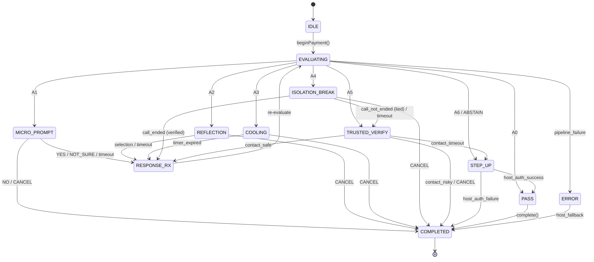

> [!IMPORTANT]
> **AI AGENT DIRECTIVE**
> This document contains strict architectural rules for VYUHA 2.0. Any AI agent or coding assistant operating in this repository must abide by these constraints. Do not deviate, simplify, or hallucinate outside these boundaries. Log any new learnings, corrections, or workflow resolutions to the `.ai/` directory.

# Intervention State Machine
**Owner: Alaukik Saxena (HCI / Safety Interaction Engineer)**
**Consumers: Sneha (UI implementation), Aditya (SDK session lifecycle), Trombokendu (policy integration)**

This document defines the formal finite state machine governing all Vyuha intervention flows. Every transition has an explicit guard condition, effect, and timeout behavior.

---

## 1. States

| State ID | Name | Description | UI Visibility |
|---|---|---|---|
| `S0` | `IDLE` | No active payment session. SDK initialized, waiting for `beginPayment()`. | None |
| `S1` | `EVALUATING` | SDK is running the OODA cycle (Triage → MoE → Belief → Policy). Transient state, <50ms. | None (transparent to user) |
| `S2` | `PASS` | Policy returned A0_PASS. Transaction proceeds without friction. | None |
| `S3` | `MICRO_PROMPT` | Policy returned A1. Minimal question displayed. Awaiting user response. | Bottom sheet / inline card |
| `S4` | `REFLECTION` | Policy returned A2. Reflection challenge displayed. Awaiting user selection. | Full-height modal |
| `S5` | `COOLING` | Policy returned A3. Mandatory delay active. Timer counting down. | Full-screen with countdown |
| `S6` | `ISOLATION_BREAK` | Policy returned A4. Communication/capture remediation required before proceeding. | Full-screen, high-urgency overlay |
| `S7` | `TRUSTED_VERIFY` | Policy returned A5. Safety Circle verification in progress. | Full-screen with contact status |
| `S8` | `STEP_UP` | Policy returned A6. Host institution step-up required. | Host-rendered (bank's auth UI) |
| `S9` | `RESPONSE_RECEIVED` | User has responded to an intervention. SDK re-evaluates. Transient. | Loading indicator (optional) |
| `S10` | `COMPLETED` | Session finalized. No further transitions. | None |
| `S11` | `ERROR` | Unrecoverable SDK error. Delegates to host fallback. | Host-rendered error |

---

## 2. Transition Table

### Primary Transitions

| From | Event / Trigger | Guard Condition | To | Effect |
|---|---|---|---|---|
| `S0` | `beginPayment(tx)` | SDK initialized | `S1` | Create session, prefetch graph token |
| `S1` | `evaluate()` returns A0 | `p_coercion < 0.15 && !uncertain` | `S2` | Log trace; no UI |
| `S1` | `evaluate()` returns A1 | `0.15 ≤ p_coercion < 0.30` | `S3` | Render MICRO_PROMPT UI |
| `S1` | `evaluate()` returns A2 | `0.30 ≤ p_coercion < 0.50` | `S4` | Render REFLECTION UI |
| `S1` | `evaluate()` returns A3 | `0.50 ≤ p_coercion < 0.65` | `S5` | Start cooldown timer; render COOLING UI |
| `S1` | `evaluate()` returns A4 | `0.65 ≤ p_coercion < 0.85 && comm_active` | `S6` | Render ISOLATION_BREAK UI; haptic pulse |
| `S1` | `evaluate()` returns A5 | `0.85 ≤ p_coercion < 0.95` | `S7` | Initiate Safety Circle notification |
| `S1` | `evaluate()` returns A6 | `p_coercion ≥ 0.95 OR ABSTAIN` | `S8` | Delegate to host institution |
| `S1` | `evaluate()` throws | Model/pipeline failure | `S11` | Log error; delegate to host |

### User Response Transitions

| From | Event / Trigger | Guard Condition | To | Effect |
|---|---|---|---|---|
| `S3` | User taps `YES` | — | `S9` | Record response=CONTINUED; re-evaluate |
| `S3` | User taps `NO` | — | `S10` | Record response=CANCELLED; complete(CANCELLED) |
| `S3` | User taps `NOT_SURE` | — | `S9` | Record response=UNCERTAIN; re-evaluate (typically escalates) |
| `S3` | Timeout (30s) | No interaction | `S9` | Record response=TIMEOUT; re-evaluate (escalation) |
| `S4` | User selects option | Valid selection | `S9` | Record selection; re-evaluate |
| `S4` | User taps `CANCEL` | — | `S10` | Record response=CANCELLED; complete(CANCELLED) |
| `S4` | Timeout (45s) | No interaction | `S9` | Record response=TIMEOUT; re-evaluate (escalation) |
| `S5` | Timer expires | Countdown = 0 | `S9` | Record response=WAITED; re-evaluate |
| `S5` | User taps `CANCEL` | — | `S10` | Record response=CANCELLED; complete(CANCELLED) |
| `S6` | User taps `I HAVE ENDED THE CALL` | comm_active == false (verified) | `S9` | Record response=REMEDIATED; re-evaluate |
| `S6` | User taps `I HAVE ENDED THE CALL` | comm_active == true (lied) | `S7` | Escalate to TRUSTED_VERIFY; log LIED_ABOUT_CALL |
| `S6` | User taps `CANCEL` | — | `S10` | Record response=CANCELLED; complete(CANCELLED) |
| `S6` | Timeout (60s) | No interaction | `S7` | Escalate to TRUSTED_VERIFY; log TIMEOUT |
| `S7` | Contact responds `SAFE` | Valid Safety Circle response | `S9` | Record response=VERIFIED_SAFE; re-evaluate |
| `S7` | Contact responds `RISKY` | Valid Safety Circle response | `S10` | Record response=VERIFIED_RISK; complete(CANCELLED) |
| `S7` | Contact timeout (120s) | No contact response | `S8` | Escalate to STEP_UP; log SAFETY_CIRCLE_TIMEOUT |
| `S7` | User taps `CANCEL` | — | `S10` | Record response=CANCELLED; complete(CANCELLED) |
| `S8` | Host auth success | Institution confirms | `S2` | Allow transaction |
| `S8` | Host auth failure | Institution rejects | `S10` | complete(INSTITUTION_BLOCKED) |

### Re-evaluation Transitions

| From | Event / Trigger | Guard Condition | To | Effect |
|---|---|---|---|---|
| `S9` | Re-evaluate returns A0 | Evidence now sufficient for PASS | `S2` | Transaction proceeds |
| `S9` | Re-evaluate returns A1–A6 | Risk persists or escalates | `S3`–`S8` | Render new intervention |
| `S9` | Re-evaluate throws | Pipeline failure | `S11` | Log error; delegate to host |

### Terminal Transitions

| From | Event / Trigger | To | Effect |
|---|---|---|---|
| `S2` | `complete(outcome)` | `S10` | Finalize audit trace; clean up |
| `S10` | — | — | Terminal. No further transitions. |
| `S11` | Host fallback completes | `S10` | Log outcome from host |

---

## 3. State Diagram (Mermaid)



---

## 4. Escalation Rules (Hard Constraints)

These rules are **not overridable** by learned policy. They are Alaukik's HCI safety invariants.

| Rule ID | Constraint | Rationale |
|---|---|---|
| `ESC-01` | A3 (COOLING) → immediate retry within 30s → **escalate to A4** | Rapid retry after cooldown indicates scammer is maintaining live control |
| `ESC-02` | A4 (ISOLATION_BREAK) → user claims call ended but comm_active=true → **escalate to A5** | User lied under coercion; technical verification overrides verbal claim |
| `ESC-03` | A5 (TRUSTED_VERIFY) → contact timeout → **escalate to A6** | No independent verification available; institution must decide |
| `ESC-04` | A1 (MICRO_PROMPT) → NOT_SURE response → **escalate to A2 or A3** | Uncertainty is a weak positive signal for coercion |
| `ESC-05` | ANY intervention → timeout → **escalate by +1 severity** | Inaction under a warning is evidence of external pressure |
| `ESC-06` | A4 → NEVER downgrade to A1/A2 | Once isolation break is warranted, lower friction is insufficient |

---

## 5. De-escalation Rules

| Rule ID | Condition | Effect |
|---|---|---|
| `DE-01` | A4 → comm_active becomes false (verified) → re-evaluate | With scammer control severed, belief state will typically drop |
| `DE-02` | A5 → contact confirms SAFE → re-evaluate | Independent human verification is strong negative evidence |
| `DE-03` | Any state → user voluntarily provides information that resolves ambiguity → re-evaluate | E.g., user explains transaction purpose clearly (captured in response ontology) |

---

## 6. Timeout Configuration

| State | Default Timeout | On Timeout |
|---|---|---|
| `S3` MICRO_PROMPT | 30 seconds | Escalate (ESC-05) |
| `S4` REFLECTION | 45 seconds | Escalate (ESC-05) |
| `S5` COOLING | 15–30 seconds (configurable) | Auto-transition to re-evaluate |
| `S6` ISOLATION_BREAK | 60 seconds | Escalate to A5 |
| `S7` TRUSTED_VERIFY | 120 seconds | Escalate to A6 |
| `S8` STEP_UP | Host-defined | Host fallback |

---

## 7. Session Lifecycle Contract

```
Host App                          Vyuha SDK                        User
   │                                  │                              │
   │──beginPayment(tx)───────────────>│                              │
   │                                  │──prefetchGraphRisk()         │
   │──observe(signals)───────────────>│                              │
   │──evaluate()─────────────────────>│                              │
   │                                  │──[OODA cycle]                │
   │<──InterventionDecision──────────│                              │
   │                                  │                              │
   │  [If actionId ≠ A0_PASS]        │                              │
   │──renderIntervention(decision)──────────────────────────────────>│
   │                                  │                              │
   │<──────────────────────────────userResponse──────────────────────│
   │──recordResponse(response)──────>│                              │
   │                                  │──[re-evaluate]               │
   │<──InterventionDecision──────────│                              │
   │                                  │                              │
   │  [If actionId == A0_PASS]       │                              │
   │──allowTransaction()─────────────────────────────────────────────>│
   │──complete(outcome)──────────────>│                              │
   │                                  │──[audit trace]               │
```

---

## 8. Implementation Notes for Consumers

### For Sneha (UI):
- Each state `S3`–`S8` maps to exactly ONE Compose screen.
- Transitions are driven by user interaction callbacks that invoke `session.recordResponse()`.
- Timeout handling must be implemented with coroutine-based timers (not UI thread blocking).
- The `EVALUATING` and `RESPONSE_RX` states are invisible to the user (<50ms).

### For Aditya (SDK):
- `Session.kt` already has `State { ACTIVE, INTERVENTION_PENDING, COMPLETED }`. This FSM refines those three states into the full 12-state machine.
- The `recordResponse()` → `evaluate()` re-entrant loop maps directly to the `S9 → S1` transition.
- Guard conditions (e.g., `comm_active` verification for A4) must be checked by the SDK before accepting user claims.

### For Trombokendu (Policy):
- The policy bandit's output (ActionId) selects the target state.
- Escalation rules (`ESC-01` through `ESC-06`) are **hard constraints** that override policy output.
- The policy must never select an action that violates an active escalation (e.g., returning A1 after A4 has been triggered in the same session).
