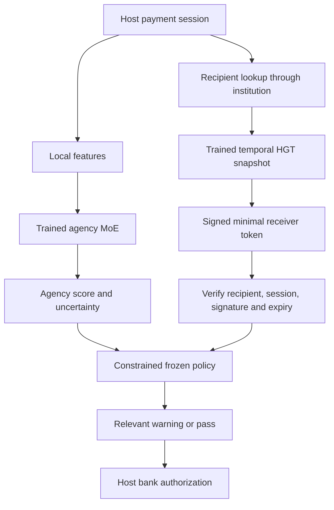

# Vyuha 2.1 — project and engineering guide

Document date: 14 September 2026. Audience: the team, technical reviewers, mentors and prospective institutional partners. Read with ADR-005, the generated evaluation reports, and the deployment runbook. “Implemented” below means present in this repository; it does not mean certified for handling real bank payments.

## What we are building

Vyuha is a payment-safety component that a cooperating bank or payment provider embeds inside its own app. It operates before authorization. The host already knows the payment amount and recipient; Vyuha adds a local assessment of possible external influence and a separate assessment of the receiver's financial network.

Authentication answers “Is this our customer?” A genuine customer can still be following a scammer's instructions, or willingly buying from a dishonest seller. Vyuha asks two more questions: “Does the decision appear independently made?” and “Does the receiver show suspicious financial behavior?” Its output is a suggested intervention. The bank remains responsible for authorizing, holding or rejecting the payment.

The deliverables are a Kotlin SDK, an Android host-bank simulator, a Python graph-risk service, real trainable ML models, an offline policy trainer, model exports, tests, benchmarks and an engineering dashboard. The dashboard replays generated synthetic evaluation results. It is not secretly connected to a bank or monitoring a user's phone.

The intended customers are banks, PSPs, TPAPs and authorized fraud-intelligence providers. The people helped include ordinary payment users, first-time online buyers, people under coercion, users with limited technical knowledge and the bank staff investigating risky payments. Vyuha complements authentication, KYC, AML and existing fraud controls. It does not replace them, reverse completed payments, guarantee delivery of goods, or watch unrelated apps.

## The blind spot and its correction

A person sees shoes on Instagram, receives a payment QR, and voluntarily sends money. They are calm, not on a call, and not sharing their screen. Their agency risk can correctly be very low. That says nothing about whether the seller will deliver.

The new counterparty path evaluates the receiver independently. If the receiver has suspicious network behavior, the user gets a receiver warning or the bank is asked for a further check. The system does not tell the user to end a call that does not exist. If the seller has no usable history, the score is null and the state is UNKNOWN. A new online purchase then receives a merchant-verification question.

We do not need to know whether the QR came from Instagram, WhatsApp, a poster or a website. The host passes the recipient appearing in the payment. Online-purchase context can be explicitly supplied by the user or host. Vyuha does not infer it by reading DMs. Optional “share a QR to check” integration is a future user-initiated feature, not a requirement for protection.

## A payment, from beginning to end

1. The host opens a payment session with a new random session identifier. It passes a bucketed amount, a recipient reference and novelty derived from its own history. The SDK no longer invents novelty from the first byte of a hash.
2. The host starts an asynchronous receiver lookup early, ideally while the user reviews payment details. Local inference does not wait for the network.
3. The host supplies limited session signals: communication active or inactive, a capture-risk category, and a normalized baseline deviation if available. These are features, not recordings.
4. The local model computes agency risk using its trained weights. The receiver score is excluded from this calculation.
5. The local uncertainty layer asks whether the model can distinguish the safe and risk labels at its calibrated thresholds. Ambiguous evidence can produce both labels and an abstention flag.
6. The institutional service looks up the recipient's account in its current HGT snapshot. Missing history, sparse activity, old evidence or an unavailable model produce UNKNOWN.
7. The service signs a short-lived token containing only the receiver assessment and evidence metadata. The phone verifies the signature, recipient, session, audience and expiry using a trusted public key.
8. The policy receives agency risk, receiver risk, uncertainty and transaction context. A learned offline table selects among actions allowed by hard safety constraints.
9. The host renders the relevant message and collects the user's response. Pressing “continue” cannot prove a call ended or erase receiver risk. Signals must actually change; additional bank checks remain the bank's responsibility.
10. Completion cancels session work, removes cached tokens and clears SDK session context. The bank's own payment record has its own retention obligations.

## How the local ML works

The model input has six positions: communication active, capture risk, amount bucket, recipient novelty, a reserved position and baseline deviation. The reserved position used to carry graph risk; it is explicitly masked to zero so it cannot influence agency predictions. The amount values are 0.1, 0.3, 0.6 and 1.0 for the four buckets. Novelty and deviation are normalized to 0–1.

A small gate network gives a weight to each of five experts. It chooses the two strongest. Each expert is a small neural network with a hidden layer and one output. Their weighted combination produces a logit; a sigmoid converts this to a number between zero and one. There are 954 parameters in the current model. The experts learn useful partitions of the input space, but we cannot honestly label each expert “communication specialist” or “merchant specialist” without separate evidence.

Training uses synthetic examples of coercion and non-coercion, including harder benign cases: people making large payments, paying new people, or being on an ordinary call. Receiver risk is generated independently and excluded from the agency model. This helps address the original blind spot, but synthetic scenarios are still simpler than human behavior.

The Kotlin implementation reads exported model weights and executes the same linear layers, ReLU functions, top-two selection and sigmoid locally. It does not need an LLM API, internet connection or per-inference API key. Cross-language vectors compare Kotlin model and policy outputs with Python. ONNX export is also checked against PyTorch across several batch sizes and input patterns. The ONNX graph computes all experts before selecting their outputs; the native Kotlin path executes only the selected experts.

The session tracks observations without counting an unchanged snapshot as fresh independent evidence. A fixed observation should not become “certain coercion” simply because a UI recomposed a hundred times. The current implementation is a session estimate, not a proven longitudinal model of a person's psychological state. A future recurrent agency model needs sequence data and validation before such a claim is justified.

Conformal calibration uses examples separate from model training. It calculates an error threshold for each label using that label's own sample count. Small calibration classes correctly result in broad uncertainty. Its coverage interpretation depends on the calibration and future data being sufficiently comparable. It does not promise that every individual verdict is 90% correct or that coverage survives an adversary changing the data distribution.

## How the institutional ST-GNN works

A graph is a map of entities and relationships. This MVP has ACCOUNT, VPA, DEVICE and PHONE nodes. Edges describe account transfers, VPA transfers, account ownership of a VPA, device access to an account and phone association with an account. Reverse edges let information flow back toward account predictions. Without reverse ownership edges, VPA information could flow away from the account and never help its fraud prediction.

The loader checks that every edge points to real nodes. During this work, all original VPA transfer edges were found to point to nonexistent `vpa_acc_*` identifiers. The generator now creates correct IDs, and a repair script rebuilds existing VPA transactions through explicit ownership records. We do not silently discard the broken relationships.

Account features describe incoming and outgoing activity, the incoming share, outgoing amounts and burst behavior. Device and phone features describe how many accounts share a connection. These values use fixed logarithmic units rather than being independently normalized to each dataset's maximum. Fixed units prevent the meaning of “0.7” from changing between training and serving.

Every transaction edge carries its age in days relative to the snapshot, plus a transformed amount. A learned periodic time encoder and an amount projection turn those numbers into vectors. The HGT has two layers, 32 hidden values per node and four attention heads. Every head calculates its own attention weights, normalized separately for each receiving node. Relation-specific projections let a money transfer and a device link mean different things.

The model combines neighboring information and its own node representation, then predicts receiver risk for account nodes. Temperature calibration adjusts the output scale using a separate calibration partition. The token's confidence field is a score-certainty proxy, not an independently trained guarantee of correctness. Reason codes describe observable supporting signals, such as many incoming payments or rapid outgoing activity. The service does not invent complaint associations, mule proximity or shared-device allegations merely because its risk score is high.

Training uses focal loss to address imbalance, AdamW, a decreasing learning rate, gradient clipping and validation-based checkpoint selection. Account identifiers are assigned to disjoint training, validation, calibration and test label partitions using a stable hash. Training sees earlier transaction snapshots; validation and calibration use the next cutoff. Labels are not features. Related accounts can still cross partitions, so this is not an unseen-fraud-ring test. Static relationships lack observation dates in the supplied synthetic data and are explicitly assumed known at inception. Those limitations must accompany any performance claim.

Serving runs full-graph inference during refresh, then swaps in a complete immutable score snapshot. A request uses a precomputed VPA-to-account map and a score lookup. It does not run the whole graph for every payment. Refresh failure leaves the old snapshot available only within its freshness window. A synthetic graph's event dates are historical scenario dates; synthetic mode is explicitly labeled. Real institutional timestamps would have to satisfy freshness checks.

MERCHANT and COMPLAINT nodes remain a planned extension, as the attachment recommends for the MVP. The next version must ingest verified merchant identity, time-stamped and deduplicated complaints, source reliability, corrections and appeal outcomes. A complaint is an allegation, not a label. Adding such nodes without trustworthy data would make the demonstration look broader while making the model less defensible.

## Policy and interventions

| Action | Meaning | Who resolves it |
|---|---|---|
| A0 | No extra Vyuha friction | Host still performs normal authorization |
| A1 | Brief context or receiver question | User/host |
| A2 | Reflection, receiver warning or merchant verification | User independently reviews evidence |
| A3 | Cooling period recommendation | Host enforces the actual timer |
| A4 | Break active influence | Host checks communication/capture condition again |
| A5 | Trusted verification | Future governed contact flow; no automatic messaging implemented |
| A6 | Additional institutional check | Bank fraud/authorization controls |

The offline trainer loads the actual agency checkpoint. It generates independent receiver scenarios and simulates action outcomes using explicitly declared prevention and friction assumptions. It evaluates candidate actions with common random draws, averages rewards and saves the preferred action for supported states. The artifact records model checksum, calibration, seed and state support. Unsupported states use conservative constrained defaults. Runtime never explores weaker actions on live users.

The policy cannot choose a pass for a known high-risk receiver or isolation for a calm buyer. Unknown new online sellers receive a verification challenge. Strong receiver evidence is not cleared by a user saying they know the seller. The Python explanation includes bounds for the probability of either risk instead of claiming a calibrated universal payment-harm probability. These are mathematical bounds on the two model outputs; their real-world interpretation still depends on model calibration.

## Cases, edge cases and remaining limits

| Case | Current response or protection | Remaining requirement |
|---|---|---|
| Calm buyer pays fake social seller | Receiver path warns or requests bank review; no isolation | Needs receiver evidence from participating institution |
| Entirely new scammer, first victim | UNKNOWN and proportionate first-recipient/purchase check | No system can prove hidden fraudulent intent from no evidence |
| Legitimate new seller | Verification wording without fraud allegation | User studies to tune friction and abandonment |
| Digital arrest or remote coaching | High agency plus active condition can trigger A4 | Host-observed signals; no automatic ability to kill other apps |
| Coercion through a clean account | Agency path remains independent | Coercion not represented by available signals can be missed |
| Ordinary call, familiar recipient | Low agency examples can pass | Test many populations and accessibility uses before deployment |
| High amount alone | Context feature, not automatic denial | Tune by institution, including urgent medical and business payments |
| Known payee becomes compromised | Familiarity cannot override high receiver evidence | Fresh account intelligence is essential |
| Offline, timeout or broken graph model | Unknown receiver evidence; local agency still works | Host must define its own outage/authorization policy |
| Old or forged token | Signature, expiry and binding checks reject it | Trusted key rotation and authenticated gateway deployment |
| Token for another payee or session | Rejected by expected recipient/session checks | Host must create a new session for changed authorization context |
| Payee changes while request is running | Old response generation is discarded | Host passes stable recipient reference and awaits no blocking network call |
| Same snapshot evaluated repeatedly | Score and decision do not accumulate imaginary evidence | Learned sequential behavior remains future work |
| User repeatedly taps continue | Re-evaluation does not erase risky evidence | Host cooldown/step-up must prevent UI-only bypasses |
| Shared household device | Relationship is a feature, not proof | Production fairness and family-device testing |
| Complaint bombing | Not ingested by this model | Verify source, resolve duplicates, preserve dispute and correction history |
| Low-and-slow laundering or tiny split payments | May be captured by network features; not guaranteed | Add multi-window velocity and amount histories with governed retention |
| Two-phone scam, compromised OS, dishonest signals | Detection can fail when observations look normal | Server-side controls and validated integrity signals remain necessary |
| Model drift or a new scam style | Missing/ambiguous evidence can abstain | Formal drift monitors, shadow evaluation and rollback are not yet deployed |
| Flooding/enumerating receiver lookups | Service requires institutional authentication outside demo | Gateway rate limits, tenant isolation, abuse monitoring and body limits |
| Insider access or stolen server signing key | Minimized tokens and separate public verification | HSM/KMS, least privilege, key revocation and incident drills |
| Children or vulnerable users | No claim of blanket legal exemption | Institution must establish applicable rules and suitable human assistance |

No code change can fully solve a missing institutional feed, hidden intent, social pressure, a hostile operating system or poor human response design. These limits are release requirements, not promises disguised as implemented features.

## Privacy boundaries and DPDP readiness

The local model receives limited first-party payment features. The graph remains with the institution. The API accepts only a recipient reference and session UUID, rejects unknown request fields, and does not accept raw VPA strings in its hash field. Telemetry collection returns 501 until a governed audit sink exists. Optional local diagnostic logging is disabled by default. Training uses synthetic data; model files contain learned numbers, not customer histories.

The prohibited-content list includes DMs, SMS contents, notifications, audio, voice stress, facial emotion, screenshots and clipboard history. None is needed for this design. See `privacy/signal-manifest.json` for each signal's source, purpose and retention boundary. Local memory clearing means releasing session state, not guaranteeing physical zeroization by the operating system or Python/JVM garbage collector.

Android app-access-risk verdicts can categorize possible capture, control or overlays. Verified accessibility services are treated specially by Play's verdict system. Availability and results depend on platform and Play configuration; a missing verdict must stay unknown. Vyuha has not integrated live Play Integrity in this prototype. See Google's [integrity-verdict documentation](https://developer.android.com/google/play/integrity/verdicts).

The DPDP Act requires a valid processing basis and provides duties concerning notice, consent where relied on, security and individual rights. Consent withdrawal must be supported where consent is the basis, subject to applicable legal grounds for continued processing. A SDK architecture does not settle those institutional obligations. See the [official DPDP Act](https://www.meity.gov.in/static/uploads/2024/02/Digital-Personal-Data-Protection-Act-2023-1.pdf).

The notified Rules address understandable notices, safeguards and breach-related duties, among other matters. Deployment needs real owners, records and operating procedures for these duties. The repository supplies technical boundaries, not a legal compliance certificate. See the [notified DPDP Rules](https://www.meity.gov.in/static/uploads/2025/11/53450e6e5dc0bfa85ebd78686cadad39.pdf).

As of this document's date, commencement is phased. The notification places many core processing provisions in the group commencing eighteen months after publication of the November 2025 notification. Do not say every DPDP obligation was already fully applicable in September 2026, or that Vyuha is “100% compliant.” Use “designed for DPDP-aligned deployment,” followed by the remaining controls. See the [official commencement notification](https://www.meity.gov.in/static/uploads/2025/11/c56ceae6c383460ca69577428d36828b.pdf).

In a typical institutional deployment the bank decides the purpose and acts as Data Fiduciary, with Vyuha processing under its instructions. This allocation must be confirmed contractually. If Vyuha independently determines new purposes or builds cross-bank profiles, the responsibilities change. A SHA-256 VPA hash remains linkable and vulnerable to guessing; it is not anonymous. Production should tokenize identifiers within the institution and never put a reusable bank API credential in a mobile app.

Before a real deployment, name an owner for: lawful processing basis; understandable notices and language access; optional-signal choices; consent records and withdrawal; access/correction/erasure/grievance workflows; processor agreements; security and retention schedules; incident response; children-related processing; cross-border arrangements where relevant; and any applicable significant-fiduciary obligations. Sector-specific financial rules may add requirements. These are matters for the institution's legal and security teams using the actual deployment facts.

## Why the ML is useful, and what we deliberately avoid

The graph can learn combinations of connections and timing that are awkward to enumerate as separate rules. The local MoE can distinguish combinations of ordinary behavior from the synthetic coercion scenarios without sending session features to a model API. The policy joins risk with a user-facing action while keeping hard safety boundaries visible.

We have not added RAG simply to advertise it. Retrieval over bank-approved help content could later support a separate explanation or analyst-assistance tool. An LLM should not invent receiver facts, classify private messages collected without need, or decide payment authority. The present authorization path runs small, inspectable local and graph models.

## Reading the evidence honestly

`MVP_REPORT.json` contains receiver precision, recall, PR-AUC, ROC-AUC, false positives, calibration, a validation-selected threshold, a feature-only baseline and a no-edge ablation. `E2E_REPORT.json` contains trained agency scores and scenario decisions. `BENCHMARK_REPORT.json` distinguishes local Python, graph refresh, lookup/signing, in-process API and optional HTTP timings. `exports/*_card.json` records model format, hashes and export verification. The SDK tests compare actual Kotlin predictions and policy decisions with Python vectors.

PR-AUC describes how well risky cases are ranked when positives are uncommon. Precision asks how many flagged cases were actually labeled risky; recall asks how many labeled risky cases were found. False-positive rate describes legitimate cases flagged. Calibration asks whether a score roughly matches observed frequency. None of these is “percentage of all real scams prevented.” Synthetic labels and simulator outcomes cannot establish financial loss reduction.

Physical-device latency, battery impact, accessibility, demographic fairness, unseen scam-ring generalization, real bank data quality, release signing, and regulated operational readiness need separate evidence. Read the runbook's release gates before presenting this work as a deployable banking product.
